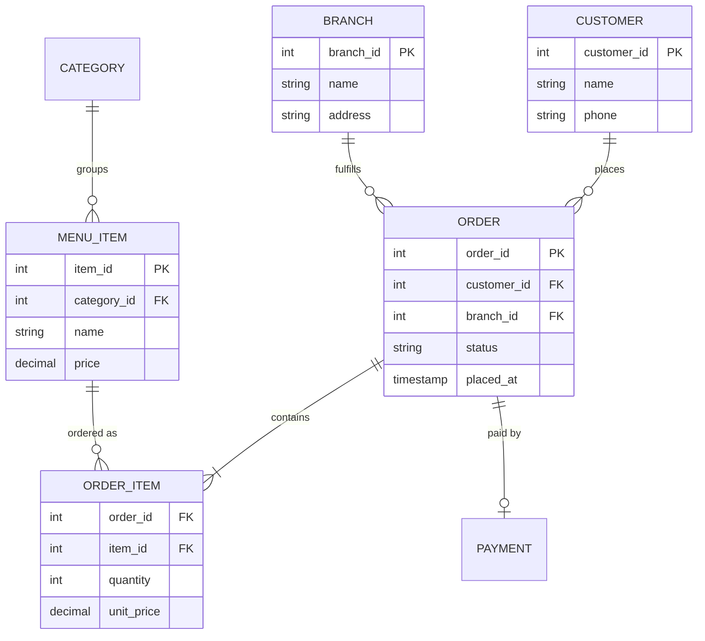

# Therap Database Engineer

## Interview Stages

The selection process has 4 stages,

1. **Initial screening:** This round is taken in written format
1. **1st technical round** The first round is taken by the BD team
1. **2nd technical round:** This round is typically taken by both USA and BD team. However, the final selection is done by the US team.
1. **HR Round:** This is the final stage before onboarding and typically deals with salary negotiation. 

## Database Questions

<article>

Design an ERD of online restaurant management system

<details><summary>Theory and explanation</summary>

An **Entity-Relationship Diagram (ERD)** models real-world entities, their attributes, and how they relate. For an **online restaurant** system, interviewers expect you to cover ordering, menu, customers, delivery, and inventory at a sensible granularity.

**Core entities (typical)**

| Entity | Key attributes | Notes |
|--------|----------------|-------|
| **Customer** | `customer_id`, name, phone, email, address | May link to multiple delivery addresses |
| **Restaurant / Branch** | `branch_id`, name, location, hours | Multi-branch chains need branch FK on orders |
| **Menu / Category** | `category_id`, name | Groups items (Appetizer, Main) |
| **MenuItem** | `item_id`, name, price, description, availability | Belongs to one category |
| **Order** | `order_id`, `customer_id`, `branch_id`, status, placed_at, total | Status: pending → confirmed → preparing → delivered |
| **OrderItem** | `order_id`, `item_id`, quantity, line_price | Resolves M:N between Order and MenuItem |
| **Payment** | `payment_id`, `order_id`, method, amount, status | Optional separate entity |
| **Delivery** | `delivery_id`, `order_id`, address, driver_id, ETA | Optional if pickup-only |

**Cardinality (talk through aloud)**

- Customer **1 — M** Order
- Order **1 — M** OrderItem; MenuItem **1 — M** OrderItem (junction for line items)
- Branch **1 — M** Order; Branch **1 — M** MenuItem (menu per branch) if menus differ by location

**Design choices interviewers probe**

- **Normalization:** Avoid duplicating menu item name on every OrderItem — store `item_id` + snapshot `unit_price` at order time if prices change.
- **Soft deletes** vs hard deletes for menu items still referenced by old orders.
- **Indexes:** `(customer_id, placed_at)` on Order; `(order_id)` on OrderItem.

**Interview talking points**

- Draw **crow's foot** notation clearly; label PK/FK.
- Mention **audit columns** (`created_at`, `updated_at`) on transactional tables.
- If time allows: **inventory** (ingredients per dish) or **ratings** as extension entities.

#### Further reading

- [Lucidchart: ER diagram symbols](https://www.lucidchart.com/pages/er-diagram-symbols-and-meaning) — notation reference
- [Martin Fowler: Analysis Patterns](https://martinfowler.com/eaaCatalog/) — enterprise data modeling patterns
- [PostgreSQL: Foreign keys](https://www.postgresql.org/docs/current/ddl-constraints.html#DDL-CONSTRAINTS-FK) — enforcing relationships

</details>

<details><summary>Solution (JavaScript)</summary>

Mermaid-style ERD you can redraw on a whiteboard (logical model):



#### Code walkthrough

- **ORDER_ITEM** is the associative entity between Order and MenuItem (line-level detail).
- **PAYMENT** optional 1:1 with Order keeps financial data separate from fulfillment status.
- Extend with **DELIVERY_ADDRESS** if customers have many saved addresses.

#### Complexity

| | |
|-|-|
| Time | N/A (conceptual design) |
| Space | N/A (conceptual design) |

#### Edge cases

- **Cancelled orders** — status enum + do not delete rows (audit trail).
- **Split payment / partial refund** — may need PaymentAdjustment entity.
- **Same item twice** — two OrderItem rows or quantity column; state your choice.

</details>

</article>

<article>

What is Database Transaction

<details><summary>Theory and explanation</summary>

A **database transaction** is a logical unit of work comprising one or more SQL operations that the DBMS treats as **atomic**: either **all** changes commit together or **none** persist (rollback on failure).

**Why transactions matter**

- **Money transfers:** debit account A and credit account B must both succeed or both fail.
- **Order placement:** insert Order, OrderItems, and decrement inventory cannot leave half-finished state.
- **Concurrency:** without isolation, two sessions can read/write the same rows inconsistently.

**Lifecycle**

1. `BEGIN` (or implicit begin)
2. Execute `INSERT` / `UPDATE` / `DELETE` / `SELECT … FOR UPDATE`
3. `COMMIT` — durable apply, or `ROLLBACK` — undo since begin

**Interview talking points**

- Tie transactions to **ACID** (next question).
- Mention **autocommit** mode in MySQL/PostgreSQL (each statement alone unless wrapped).
- **Distributed transactions** (2PC) are rare in modern microservices — prefer **sagas** / outbox pattern instead.

#### Further reading

- [PostgreSQL: BEGIN](https://www.postgresql.org/docs/current/sql-begin.html) — transaction control
- [MySQL: InnoDB transactions](https://dev.mysql.com/doc/refman/8.0/en/innodb-transaction-model.html) — storage-engine behavior
- [Martin Kleppmann: Designing Data-Intensive Applications](https://dataintensive.net/) — Ch. 7 transactions

</details>

<details><summary>Solution (JavaScript)</summary>

Illustrative pseudo-flow (not a real DB API):

```js
async function placeOrder(db, customerId, items) {
  const conn = await db.getConnection();
  try {
    await conn.beginTransaction();

    const orderId = await conn.insertOrder(customerId);
    for (const { itemId, qty } of items) {
      await conn.insertOrderItem(orderId, itemId, qty);
      await conn.decrementStock(itemId, qty);
    }

    await conn.commit();
    return orderId;
  } catch (err) {
    await conn.rollback();
    throw err;
  } finally {
    conn.release();
  }
}
```

#### Code walkthrough

1. **Begin** before any business writes.
2. All related writes share one connection/transaction scope.
3. **Rollback** on any failure so partial order + stock change never commits.
4. **Commit** only when every step succeeded.

#### Complexity

| | |
|-|-|
| Time | N/A (conceptual); depends on statement count |
| Space | N/A (conceptual); undo logs managed by DBMS |

#### Edge cases

- **Deadlock** — DB may abort one transaction; app retries with backoff.
- **Long transactions** — hold locks too long; keep units of work small.
- **Read-only reporting** — use `READ ONLY` or replica to avoid blocking OLTP.

</details>

</article>

<article>

Briefly explain ACID properties

<details><summary>Theory and explanation</summary>

**ACID** is a set of properties of database transactions intended to guarantee data validity despite errors, power failures, and other mishaps. Databases that support this are called **ACID-compliant**. The properties are:

- **Atomicity:** Each statement in a transaction (read, write, update, delete) is treated as a single unit. Either the entire transaction executes, or none of it does (rollback).
- **Consistency:** The database moves from one **valid state** to another according to defined rules (constraints, triggers, FKs). Illegal states (negative balance, orphan OrderItem) must not commit.
- **Isolation:** Concurrent transactions behave as if they run in some serial order. Isolation levels (READ UNCOMMITTED → SERIALIZABLE) trade performance vs anomalies (dirty read, non-repeatable read, phantom).
- **Durability:** After `COMMIT`, committed data survives crashes (WAL/redo logs, replicated storage).

> [!IMPORTANT]
> Atomicity, isolation, and durability are primarily **database engine** guarantees. **Consistency** is often enforced jointly by the **application** (business rules) and **schema constraints**. The “C” in ACID was included to complete the acronym; in *Designing Data-Intensive Applications*, Kleppmann notes consistency is not purely a storage-layer property.

**Interview talking points**

- Give a **transfer example** for atomicity.
- Name **isolation anomalies** and which level prevents them.
- Contrast **ACID (OLTP)** with **BASE (many NoSQL)** for availability/partition tolerance.

#### Further reading

- [PostgreSQL: Transaction isolation](https://www.postgresql.org/docs/current/transaction-iso.html) — levels and phenomena
- [Wikipedia: ACID](https://en.wikipedia.org/wiki/ACID) — quick reference
- [Martin Kleppmann, DDIA Ch. 7](https://dataintensive.net/) — deep treatment of transactions

</details>

<details><summary>Solution (JavaScript)</summary>

Mapping ACID to application checks (conceptual checklist):

```js
// Consistency (app + DB): enforce before commit
function assertValidTransfer(fromBal, toBal, amount) {
  if (amount <= 0) throw new Error('amount must be positive');
  if (fromBal < amount) throw new Error('insufficient funds');
  if (toBal < 0) throw new Error('invalid destination balance');
}

// Atomicity + Durability: handled by DB transaction + WAL (not in app code)
// Isolation: choose level — e.g. SERIALIZABLE for critical ledger
```

#### Code walkthrough

- **Consistency** example: app validates balances; DB adds `CHECK (balance >= 0)`.
- **Atomicity/durability** — delegate to `BEGIN`/`COMMIT`; app must not commit halfway.
- **Isolation** — set session isolation or use `SELECT … FOR UPDATE` for contested rows.

#### Complexity

| | |
|-|-|
| Time | N/A (conceptual) |
| Space | N/A (conceptual) |

#### Edge cases

- **Eventually consistent replicas** — reads after write may lag; not full ACID on replica.
- **Nested transactions** — often savepoints, not true nested ACID in all engines.

</details>

</article>

<article>

What is normalization and denormalization

<details><summary>Theory and explanation</summary>

**Normalization** is the process of organizing tables to **reduce redundancy** and **anomaly risk** (insert/update/delete anomalies) by splitting data and using foreign keys. Higher normal forms remove more dependency problems.

| Normal form | Idea |
|-------------|------|
| **1NF** | Atomic columns; no repeating groups |
| **2NF** | No partial dependency on composite PK |
| **3NF** | No transitive dependency (non-key → non-key) |
| **BCNF** | Every determinant is a candidate key |

**Denormalization** intentionally **duplicates** data (e.g. store `customer_name` on `Order`) to speed **reads**, simplify queries, or support reporting — at the cost of **update anomalies** and storage.

**When to normalize**

- OLTP systems, frequently updated schemas, many writers.

**When to denormalize**

- Read-heavy dashboards, materialized aggregates, caching product name on order lines for historical accuracy.

**Interview talking points**

- Normalization favors **write correctness**; denormalization favors **read latency**.
- **Star schema** in warehouses is controlled denormalization for analytics.

#### Further reading

- [GeeksforGeeks: Normal forms](https://www.geeksforgeeks.org/normal-forms-in-dbms/) — 1NF–BCNF summary
- [Use The Index, Luke: Avoid redundant data](https://use-the-index-luke.com/) — practical indexing vs denorm
- [Kimball: Dimensional modeling](https://www.kimballgroup.com/data-warehouse-business-intelligence-resources/kimball-techniques/dimensional-modeling-techniques/) — warehouse denormalization

</details>

<details><summary>Solution (JavaScript)</summary>

Example: unnormalized vs 3NF-style split (logical):

```js
// Denormalized (bad for updates if customer renames)
const orderDenorm = {
  order_id: 1,
  customer_name: 'Alice',
  customer_phone: '017…',
  items: [{ item: 'Burger', qty: 2 }],
};

// Normalized tables
const customers = [{ customer_id: 10, name: 'Alice', phone: '017…' }];
const orders = [{ order_id: 1, customer_id: 10 }];
const orderItems = [{ order_id: 1, item_id: 5, qty: 2 }];
```

#### Code walkthrough

- Denormalized blob duplicates customer fields on every order export.
- Normalized model updates `customers.name` once; orders reference `customer_id`.
- **Denormalize deliberately:** `order_items.unit_price` snapshot at purchase time.

#### Complexity

| | |
|-|-|
| Time | N/A (conceptual) |
| Space | Normalized: less redundancy; denormalized: more storage, faster reads |

#### Edge cases

- **Over-normalization** — too many joins for hot paths; consider controlled denorm.
- **Historical truth** — denormalized snapshot on OrderItem is correct pattern for price at sale time.

</details>

</article>

<article>

Briefly explain BCNF

<details><summary>Theory and explanation</summary>

**Boyce-Codd Normal Form (BCNF)** is stricter than **3NF**. A table is in BCNF when for **every non-trivial functional dependency** `X → Y`, the determinant **`X` is a superkey** (contains a candidate key).

**Functional dependency:** If knowing `X` uniquely determines `Y`, write `X → Y`.

**Why BCNF matters**

- Eliminates many **anomaly** cases 3NF still allows when dependencies involve overlapping candidate keys.
- Common classroom example: `(student, course) → instructor` but `instructor → course` breaks BCNF if instructor is not a superkey — decompose tables.

**BCNF vs 3NF**

- Every BCNF table is in 3NF.
- Some 3NF tables are not BCNF when dependencies involve **prime attributes** (part of a candidate key).

**Interview talking points**

- State definition in terms of **determinant** and **superkey**.
- Walk one small decomposition example on paper.
- Mention **4NF/5NF** only if interviewer goes deeper (multi-valued / join dependencies).

#### Further reading

- [GeeksforGeeks: BCNF](https://www.geeksforgeeks.org/boyce-codd-normal-form-bcnf/) — examples and decomposition
- [Wikipedia: BCNF](https://en.wikipedia.org/wiki/Boyce%E2%80%93Codd_normal_form) — formal definition
- [Database Normalization (Stanford notes)](https://web.stanford.edu/class/cs145/) — academic context

</details>

<details><summary>Solution (JavaScript)</summary>

Dependency check (teaching aid):

```js
// Table: Enrollment(student_id, course_id, instructor_id)
// FDs given in interviews:
//   {student_id, course_id} -> instructor_id  (enrollment picks instructor)
//   instructor_id -> course_id                  (each instructor teaches one course)

// BCNF violation: instructor_id -> course_id but instructor_id is NOT a superkey
// Fix: split into InstructorCourse(instructor_id, course_id)
//      and Enrollment(student_id, course_id, instructor_id)
```

#### Code walkthrough

1. List all non-trivial FDs for the table.
2. For each `X → Y`, ask: is `X` a superkey?
3. If not, decompose so determinants become keys in smaller tables.

#### Complexity

| | |
|-|-|
| Time | N/A (conceptual) |
| Space | N/A (conceptual) |

#### Edge cases

- **Lossless join** — decomposition must reconstruct original without spurious rows.
- **Dependency preservation** — not always achievable with BCNF splits.

</details>

</article>

<article>

Explain data warehousing

<details><summary>Theory and explanation</summary>

A **data warehouse** is a centralized, **subject-oriented**, **integrated**, **time-variant**, **non-volatile** store optimized for **analytics and reporting**, separate from **OLTP** operational databases.

**Inmon vs Kimball (high level)**

- **Inmon:** enterprise data warehouse as integrated 3NF hub; marts feed from it.
- **Kimball:** **dimensional modeling** — star/snowflake schemas with fact and dimension tables.

**Typical architecture**

1. **OLTP** (PostgreSQL, etc.) — daily transactions.
2. **ETL / ELT** — extract, transform, load into warehouse (batch or streaming).
3. **Warehouse** (BigQuery, Redshift, Snowflake) — large scans, aggregations.
4. **BI tools** (Metabase, Power BI) — dashboards for business users.

**Fact vs dimension**

- **Fact table:** measures (sales_amount, quantity); FKs to dimensions; grain = one row per event.
- **Dimension table:** descriptive context (date, customer, product).

**Interview talking points**

- OLTP optimized for **short writes**; warehouse for **read-heavy aggregates**.
- Mention **SCD Type 2** for slowly changing dimensions (customer address history).
- **Lakehouse** blends raw lake + warehouse semantics — optional modern note.

#### Further reading

- [Kimball Group: Dimensional modeling](https://www.kimballgroup.com/data-warehouse-business-intelligence-resources/kimball-techniques/dimensional-modeling-techniques/) — star schema
- [Google BigQuery: What is a data warehouse](https://cloud.google.com/learn/what-is-a-data-warehouse) — cloud perspective
- [AWS: Data warehouse vs database](https://aws.amazon.com/compare/the-difference-between-a-data-warehouse-database-data-lake-and-data-mart/) — ecosystem map

</details>

<details><summary>Solution (JavaScript)</summary>

Minimal star-schema sketch (logical):

```sql
-- Dimension: date
CREATE TABLE dim_date (
  date_key      INT PRIMARY KEY,
  full_date     DATE,
  month         INT,
  year          INT
);

-- Dimension: customer
CREATE TABLE dim_customer (
  customer_key  INT PRIMARY KEY,
  customer_id   INT,
  name          VARCHAR(100)
);

-- Fact: sales
CREATE TABLE fact_sales (
  sale_key      BIGINT PRIMARY KEY,
  date_key      INT REFERENCES dim_date(date_key),
  customer_key  INT REFERENCES dim_customer(customer_key),
  product_key   INT,
  amount        DECIMAL(12,2),
  quantity      INT
);

-- Analyst query
SELECT d.year, SUM(f.amount)
FROM fact_sales f
JOIN dim_date d ON f.date_key = d.date_key
GROUP BY d.year;
```

#### Code walkthrough

- Facts hold **numeric measures** and keys to dimensions.
- Dimensions answer **who/when/what** filters without touching OLTP.
- ETL job loads facts periodically from operational DB.

#### Complexity

| | |
|-|-|
| Time | N/A (conceptual); warehouse queries often O(scan) on columnar stores |
| Space | Large historical retention by design |

#### Edge cases

- **Late-arriving facts** — adjust ETL or use snapshot dates.
- **PII in dimensions** — mask/hash for GDPR/HIPAA contexts (relevant to Therap healthcare domain).

</details>

</article>

<article>

Explain data redundancy

<details><summary>Theory and explanation</summary>

**Data redundancy** means the **same logical fact** is stored in **more than one place**. It can be accidental (poor design) or **intentional** (denormalization, replication).

**Problems of uncontrolled redundancy**

- **Update anomaly:** change address in one copy but not another → inconsistency.
- **Insert anomaly:** cannot add data without unrelated facts present.
- **Delete anomaly:** removing one row loses unrelated information duplicated in that row.

**Controlled redundancy**

- **Replication** across DB nodes for **availability** (same data, synchronized).
- **Denormalized columns** for performance with clear **source of truth**.
- **Materialized views** — redundant precomputed aggregates refreshed on schedule.

**Interview talking points**

- Contrast redundancy with **normalization** goal (eliminate redundancy).
- When Therap/healthcare context: stress **single source of truth** for patient identifiers; audit trails if copies exist.

#### Further reading

- [GeeksforGeeks: Anomalies in DBMS](https://www.geeksforgeeks.org/anomalies-in-dbms/) — redundancy-driven problems
- [PostgreSQL: Materialized views](https://www.postgresql.org/docs/current/sql-creatematerializedview.html) — controlled duplicate aggregates
- [DDIA: Replication](https://dataintensive.net/) — distributed redundancy

</details>

<details><summary>Solution (JavaScript)</summary>

```js
// Redundant: customer email on both CUSTOMER and ORDER tables
const customer = { id: 1, email: 'a@x.com' };
const order = { id: 99, customer_id: 1, customer_email: 'a@x.com' }; // duplicate

// Fix: store customer_id on order only; join when email needed
// OR denormalize with documented rule: copy email at order time only
const orderSnapshot = {
  id: 99,
  customer_id: 1,
  customer_email_at_order: 'a@x.com',
};
```

#### Code walkthrough

- First design duplicates live email — update customer requires updating all orders.
- Snapshot column is **intentional redundancy** for historical accuracy.

#### Complexity

| | |
|-|-|
| Time | N/A (conceptual) |
| Space | Redundant storage increases disk use |

#### Edge cases

- **Cache layers** (Redis) — redundant copy of DB data; need invalidation strategy.
- **CSV exports** — redundant snapshots for compliance, not live joins.

</details>

</article>

<article>

Briefly mention the differences between stored procedure, function and trigger

<details><summary>Theory and explanation</summary>

All three are **server-side database program objects**, but they differ in **how they are invoked**, **what they return**, and **when they run**.

| | **Stored procedure** | **Function (UDF)** | **Trigger** |
|---|---------------------|-------------------|-------------|
| **Invocation** | `CALL proc(...)` / `EXEC` | Used inside SQL expressions `SELECT fn()` | Fires automatically on `INSERT`/`UPDATE`/`DELETE` |
| **Return value** | Often multiple result sets / OUT params; not always scalar | Must return a value (scalar or table) | No direct return to client; may raise error |
| **Use in SELECT** | Typically no | Yes (scalar/table functions) | No |
| **Transaction control** | Often can `COMMIT`/`ROLLBACK` (engine-dependent) | Usually cannot commit inside function | Runs in context of triggering statement |
| **Typical use** | Batch jobs, complex business workflows | Reusable computations, constraints | Audit logs, validation, cascaded rules |

**Triggers:** `BEFORE` vs `AFTER`, `FOR EACH ROW` vs statement-level — know your engine (Oracle, PostgreSQL, MySQL).

**Interview talking points**

- Prefer application logic unless **performance** or **centralized constraint** requires DB-side code.
- Triggers can make debugging harder — mention testing and visibility.

#### Further reading

- [PostgreSQL: CREATE FUNCTION](https://www.postgresql.org/docs/current/sql-createfunction.html) — UDF syntax
- [PostgreSQL: Triggers](https://www.postgresql.org/docs/current/triggers.html) — trigger behavior
- [Oracle: PL/SQL subprograms](https://docs.oracle.com/en/database/oracle/oracle-database/19/lnpls/plsql-subprograms.html) — Therap often uses Oracle-family SQL

</details>

<details><summary>Solution (JavaScript)</summary>

Oracle-flavored examples (Therap screening style):

```sql
-- Function: returns value, used in SELECT
CREATE OR REPLACE FUNCTION tax_amount(p NUMBER) RETURN NUMBER IS
BEGIN
  RETURN p * 0.15;
END;

-- Procedure: callable unit of work
CREATE OR REPLACE PROCEDURE close_day IS
BEGIN
  UPDATE daily_ledger SET closed = 'Y' WHERE business_date = TRUNC(SYSDATE);
  COMMIT;
END;

-- Trigger: audit on change
CREATE OR REPLACE TRIGGER trg_order_audit
AFTER INSERT OR UPDATE ON orders
FOR EACH ROW
BEGIN
  INSERT INTO order_audit(order_id, changed_at, new_status)
  VALUES (:NEW.order_id, SYSTIMESTAMP, :NEW.status);
END;
```

#### Code walkthrough

- **Function** embedded in queries for reusable math.
- **Procedure** orchestrates multi-step writes and explicit commit.
- **Trigger** enforces cross-cutting audit without changing every app query.

#### Complexity

| | |
|-|-|
| Time | N/A (conceptual); trigger adds per-row overhead |
| Space | N/A (conceptual); audit tables grow |

#### Edge cases

- **Recursive triggers** — infinite loop if trigger updates same table carelessly.
- **Bulk load** — disable triggers temporarily in ETL (with governance).

</details>

</article>

<article>

Briefly mention the differences between delete, drop and truncate

<details><summary>Theory and explanation</summary>

| Command | Scope | Rollback | Triggers | Speed | Typical use |
|---------|--------|----------|----------|-------|-------------|
| **DELETE** | Removes **rows** matching `WHERE` | Yes (in transaction) | Usually fires | Slower (row-level logging) | Selective removal |
| **TRUNCATE** | Removes **all rows** in table | Engine-dependent; often DDL-like | Often does not fire row triggers | Fast (deallocates/extents) | Empty table, keep structure |
| **DROP** | Removes **table object** (structure + data) | DDL commit | N/A | Fast | Remove table entirely |

**Key distinctions**

- **DELETE** can remove subset; supports `WHERE`; generates undo/redo per row.
- **TRUNCATE** resets table to empty; **cannot** truncate single row; resets identity/sequences (engine-specific).
- **DROP** removes metadata from catalog — must recreate table to use again.

**FK constraints:** `TRUNCATE` may fail if child rows reference parent; `DELETE` can cascade if defined.

#### Further reading

- [PostgreSQL: TRUNCATE](https://www.postgresql.org/docs/current/sql-truncate.html) — vs DELETE
- [Oracle: DROP TABLE](https://docs.oracle.com/en/database/oracle/oracle-database/19/sqlrf/DROP-TABLE.html) — object removal
- [SQL Server: DELETE vs TRUNCATE](https://learn.microsoft.com/en-us/sql/t-sql/statements/truncate-table-transact-sql) — Microsoft comparison

</details>

<details><summary>Solution (JavaScript)</summary>

```sql
-- DELETE: remove inactive customers only
DELETE FROM customers WHERE status = 'INACTIVE';

-- TRUNCATE: wipe staging import table
TRUNCATE TABLE staging_orders;

-- DROP: remove obsolete archive table
DROP TABLE orders_archive_2019;
```

#### Code walkthrough

- Use **DELETE** when predicate matters or foreign keys need row-by-row checks.
- Use **TRUNCATE** for full refresh of scratch tables in ETL.
- Use **DROP** only after backup/migration plan — irreversible without restore.

#### Complexity

| | |
|-|-|
| Time | DELETE O(n) rows; TRUNCATE often O(1) metadata; DROP O(1) object |
| Space | Frees space asynchronously depending on engine |

#### Edge cases

- **DELETE without WHERE** — deletes all rows but slower than TRUNCATE.
- **Privileges** — TRUNCATE/DROP often need elevated roles.
- **Replication** — DROP may break subscribers; use migrations.

</details>

</article>

<article>

Briefly mention the differences between where and having clause

<details><summary>Theory and explanation</summary>

Both filter rows, but at **different stages** of `SELECT` processing:

| | **WHERE** | **HAVING** |
|---|-----------|------------|
| **Filters** | Individual rows **before** grouping | Groups **after** `GROUP BY` |
| **Aggregates** | Cannot reference aggregate functions (in standard SQL) | Can use `SUM()`, `COUNT()`, etc. |
| **Position** | Before `GROUP BY` | After `GROUP BY` |
| **Example** | `WHERE status = 'ACTIVE'` | `HAVING COUNT(*) > 10` |

**Logical order (simplified):** `FROM` → `JOIN` → `WHERE` → `GROUP BY` → `HAVING` → `SELECT` → `ORDER BY`

**Interview talking points**

- Put row filters in **WHERE** for efficiency (fewer rows grouped).
- Use **HAVING** only when filter depends on group aggregate.
- **PostgreSQL/Oracle** allow alias quirks — stick to standard rules in interviews.

#### Further reading

- [W3Schools SQL HAVING](https://www.w3schools.com/sql/sql_having.asp) — basic examples
- [Oracle: HAVING clause](https://docs.oracle.com/en/database/oracle/oracle-database/19/sqlrf/SELECT.html#GUID-CFA006CA-6FF1-4977-AE3F-7C4F6D8B5F8E) — official syntax
- [Use The Index, Luke: Filtering](https://use-the-index-luke.com/sql/where-clause) — predicate placement performance

</details>

<details><summary>Solution (JavaScript)</summary>

```sql
-- Customers with more than 5 orders in 2023
SELECT c.customer_id, c.name, COUNT(o.order_id) AS order_count
FROM customers c
JOIN orders o ON o.customer_id = c.customer_id
WHERE o.order_date >= DATE '2023-01-01'
  AND o.order_date <  DATE '2024-01-01'
  AND o.status = 'COMPLETED'
GROUP BY c.customer_id, c.name
HAVING COUNT(o.order_id) > 5
ORDER BY order_count DESC;
```

#### Code walkthrough

- **WHERE** restricts orders to 2023 completed rows before grouping.
- **GROUP BY** collapses per customer.
- **HAVING** keeps only groups with count > 5.

#### Complexity

| | |
|-|-|
| Time | Depends on indexes on `order_date`, `customer_id` |
| Space | Sort/hash for GROUP BY |

#### Edge cases

- Filtering on aggregate in WHERE — invalid; move to HAVING.
- **HAVING without GROUP BY** — treats whole result as one group (valid but rare).

</details>

</article>

<article>

Briefly mention the differences between candidate key and super key

<details><summary>Theory and explanation</summary>

A **superkey** is any set of attributes that **uniquely identifies** a row in a relation. If `K` is a superkey, no two rows share the same values for all attributes in `K`.

A **candidate key** is a **minimal superkey** — you cannot remove any attribute from the set without losing uniqueness.

**Relationships**

- Every **candidate key** is a **superkey**.
- Not every superkey is a candidate key (may contain redundant attributes).

**Primary key:** one **chosen** candidate key used as the main identifier and for FK references.

**Example:** `Student(id, email, national_id)`

- `{id}`, `{email}`, `{national_id}` — candidate keys (minimal).
- `{id, email}` — superkey but not minimal (email alone already unique if enforced).

**Interview talking points**

- Explain how candidate keys drive **normalization** and **FK design**.
- Composite keys in junction tables: `(order_id, item_id)` often candidate key for OrderItem.

#### Further reading

- [GeeksforGeeks: Keys in DBMS](https://www.geeksforgeeks.org/keys-in-relational-model/) — candidate, super, foreign
- [Wikipedia: Candidate key](https://en.wikipedia.org/wiki/Candidate_key) — formal definition
- [Database Design (CMU 15-445)](https://15445.courses.cs.cmu.edu/) — schema design context

</details>

<details><summary>Solution (JavaScript)</summary>

```js
const student = {
  id: 42,
  email: 'a@uni.edu',
  national_id: 'N-991',
};

// Superkeys (unique identifiers):
const superkeys = [
  ['id'],
  ['email'],
  ['national_id'],
  ['id', 'email'],       // not minimal — id alone suffices
  ['id', 'email', 'national_id'],
];

// Candidate keys = minimal superkeys only:
const candidateKeys = [
  ['id'],
  ['email'],
  ['national_id'],
];
```

#### Code walkthrough

- List all superkeys by uniqueness constraints.
- Strip redundant attributes to obtain candidate keys.
- Pick one as **PRIMARY KEY** for ORM and FK references.

#### Complexity

| | |
|-|-|
| Time | N/A (conceptual) |
| Space | N/A (conceptual) |

#### Edge cases

- **NULL in unique columns** — SQL allows multiple NULLs in UNIQUE (engine-dependent); weak identifier.
- **Surrogate key** (`SERIAL`) vs natural key (email) — surrogate simplifies joins; keep natural unique constraints.

</details>

</article>

<article>

A schema has entities like CUSTOMERS, ORDERS, ORDER_ITEMS, PRODUCTS, PRODUCT_DETAILS, WAREHOUSES, INVENTORIES. Data fields of entities and cardinality relationships were given in the figure. Questions included from GROUP BY, ORDER BY, JOIN, extracting month and year from Oracle dates, and finding ranks based on some criterion. The extremely hard question was — find top 10 customers based on their total amount spent in 2023. This one involved aggregation, join of multiple tables, nested sub-query, and year extraction from date. Practise similar exercises from database textbooks (e.g. Sukarna sir's book).

<details><summary>Theory and explanation</summary>

Therap's **written screening** often gives an **ER diagram** plus SQL writing tasks mixing **joins**, **aggregates**, **filters**, and **Oracle date functions**. The capstone question — **top 10 customers by spend in a calendar year** — tests whether you can chain:

1. **Join path:** `CUSTOMERS` → `ORDERS` → `ORDER_ITEMS` → `PRODUCTS` (and optionally `INVENTORIES` / `WAREHOUSES` if spend is warehouse-scoped).
2. **Line revenue:** `SUM(quantity * unit_price)` or use precomputed `line_total`.
3. **Year filter:** `EXTRACT(YEAR FROM order_date) = 2023` or `order_date >= DATE '2023-01-01' AND order_date < DATE '2024-01-01'` (sargable, index-friendly).
4. **Aggregation:** `GROUP BY customer_id` with `SUM(...)`.
5. **Ranking / top-N:** `ORDER BY total_spent DESC FETCH FIRST 10 ROWS ONLY` (Oracle 12c+) or `ROW_NUMBER()` in a subquery.

**Oracle date extraction**

- `EXTRACT(YEAR FROM o.order_date)`
- `TO_CHAR(o.order_date, 'YYYY-MM')` for monthly reports
- Prefer **range predicates** on indexed `order_date` over `EXTRACT` in WHERE when tables are large.

**Ranking patterns**

- **`DENSE_RANK()`** — ties get same rank, no gaps after tie.
- **`ROW_NUMBER()`** — unique rank per row even on ties — clarify requirement.

**Interview talking points**

- Draw join diagram before writing SQL.
- State **assumptions:** only `COMPLETED` orders? include tax/shipping?
- Mention **indexes** on `(customer_id)`, `(order_date)`.

#### Further reading

- [Oracle: EXTRACT](https://docs.oracle.com/en/database/oracle/oracle-database/19/sqlrf/EXTRACT-datetime.html) — date parts
- [Oracle: FETCH FIRST](https://docs.oracle.com/en/database/oracle/oracle-database/19/sqlrf/SELECT.html#GUID-C4498493-58EA-4F1C-8A2D-2B1E8F5A7B3D) — top-N
- [Use The Index, Luke: Top-N queries](https://use-the-index-luke.com/sql/partial-results/fetch-next-page) — pagination and ranking performance

</details>

<details><summary>Solution (JavaScript)</summary>

Oracle SQL — top 10 customers by 2023 spend:

```sql
SELECT *
FROM (
  SELECT
    c.customer_id,
    c.name,
    SUM(oi.quantity * oi.unit_price) AS total_spent_2023
  FROM customers c
  JOIN orders o
    ON o.customer_id = c.customer_id
  JOIN order_items oi
    ON oi.order_id = o.order_id
  WHERE o.order_date >= DATE '2023-01-01'
    AND o.order_date <  DATE '2024-01-01'
    AND o.status = 'COMPLETED'
  GROUP BY c.customer_id, c.name
  ORDER BY total_spent_2023 DESC
)
WHERE ROWNUM <= 10;
```

Alternative with analytic function (ties handled explicitly):

```sql
SELECT customer_id, name, total_spent_2023
FROM (
  SELECT
    c.customer_id,
    c.name,
    SUM(oi.quantity * oi.unit_price) AS total_spent_2023,
    DENSE_RANK() OVER (ORDER BY SUM(oi.quantity * oi.unit_price) DESC) AS rnk
  FROM customers c
  JOIN orders o ON o.customer_id = c.customer_id
  JOIN order_items oi ON oi.order_id = o.order_id
  WHERE o.order_date >= DATE '2023-01-01'
    AND o.order_date <  DATE '2024-01-01'
  GROUP BY c.customer_id, c.name
)
WHERE rnk <= 10;
```

Monthly breakdown practice:

```sql
SELECT
  EXTRACT(YEAR FROM o.order_date)  AS yr,
  EXTRACT(MONTH FROM o.order_date) AS mo,
  SUM(oi.quantity * oi.unit_price) AS revenue
FROM orders o
JOIN order_items oi ON oi.order_id = o.order_id
GROUP BY EXTRACT(YEAR FROM o.order_date), EXTRACT(MONTH FROM o.order_date)
ORDER BY yr, mo;
```

#### Code walkthrough

1. Join customers to orders to line items — only completed 2023 orders in WHERE.
2. Aggregate spend per customer with `SUM(quantity * unit_price)`.
3. Sort descending and cap at 10 rows (inline view + `ROWNUM` or `FETCH FIRST 10 ROWS ONLY` in Oracle 12c+).
4. Analytic version separates **ranking** from filtering for tie-breaking clarity.

#### Complexity

| | |
|-|-|
| Time | O(rows scanned on orders/order_items); indexes on `order_date`, FKs help |
| Space | O(customers) for hash aggregate |

#### Edge cases

- **Customers with zero 2023 orders** — excluded by inner join; use `LEFT JOIN` + `HAVING SUM(...) > 0` if needed.
- **Refunded orders** — exclude `status = 'REFUNDED'` or subtract refund table.
- **Duplicate line items** — ensure grain of `order_items` is one row per item per order.

</details>

</article>

